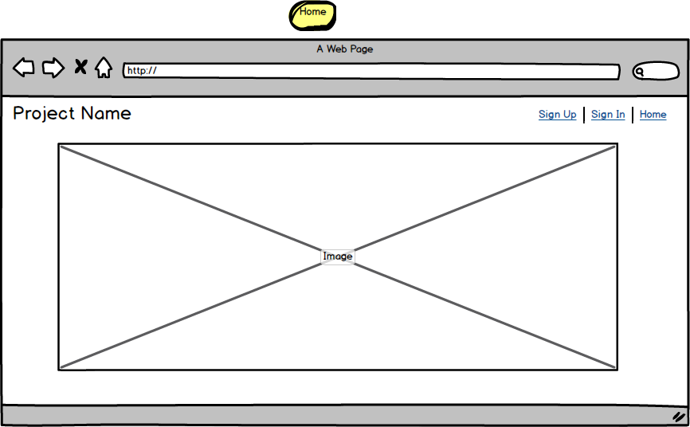
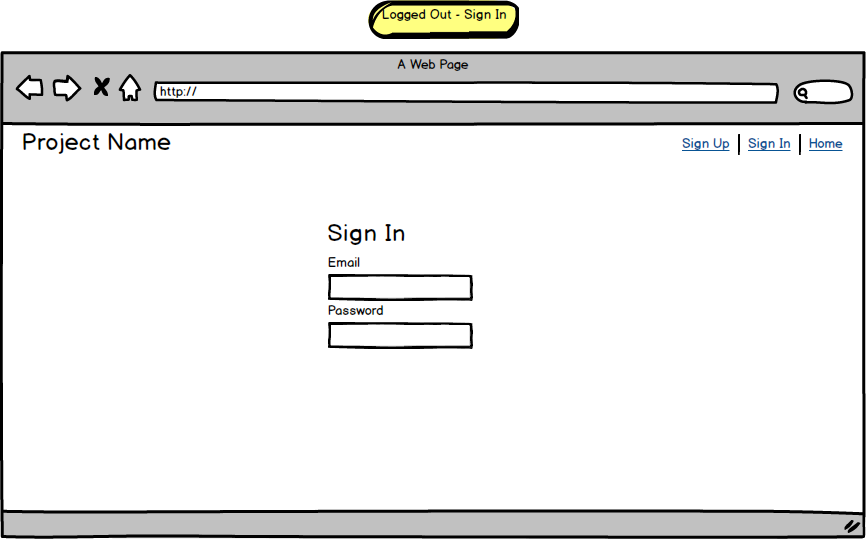
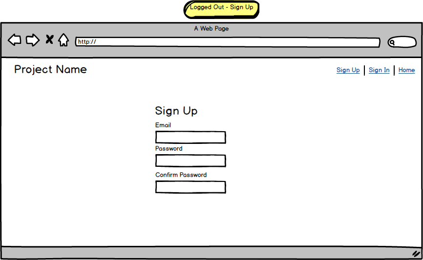
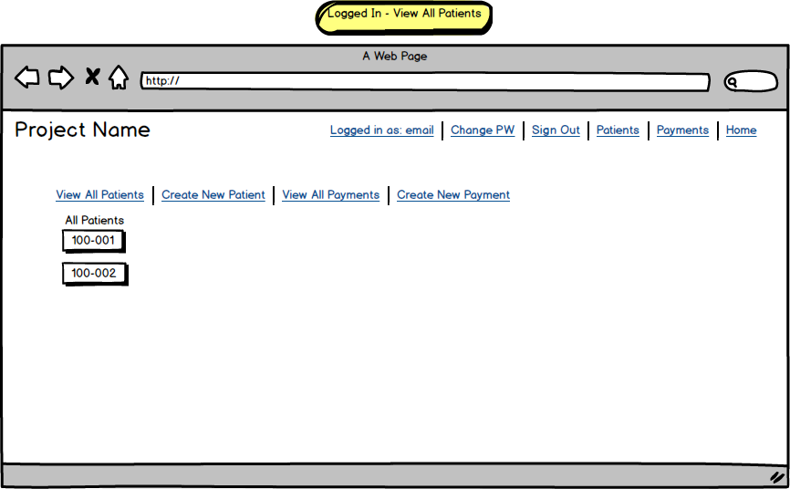
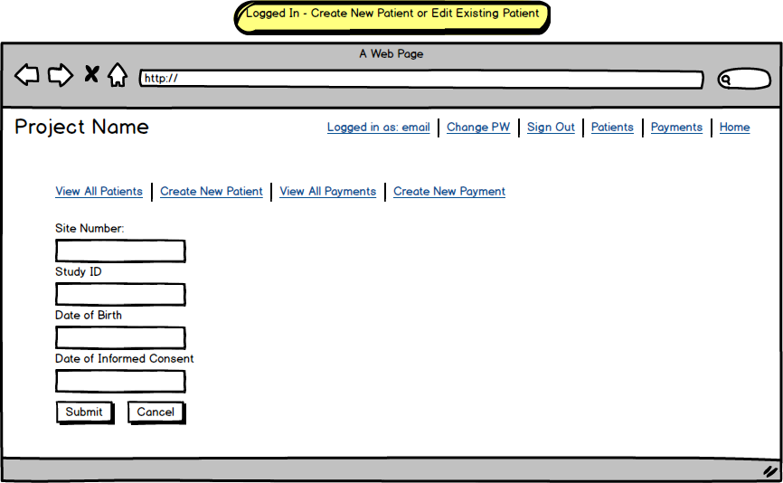
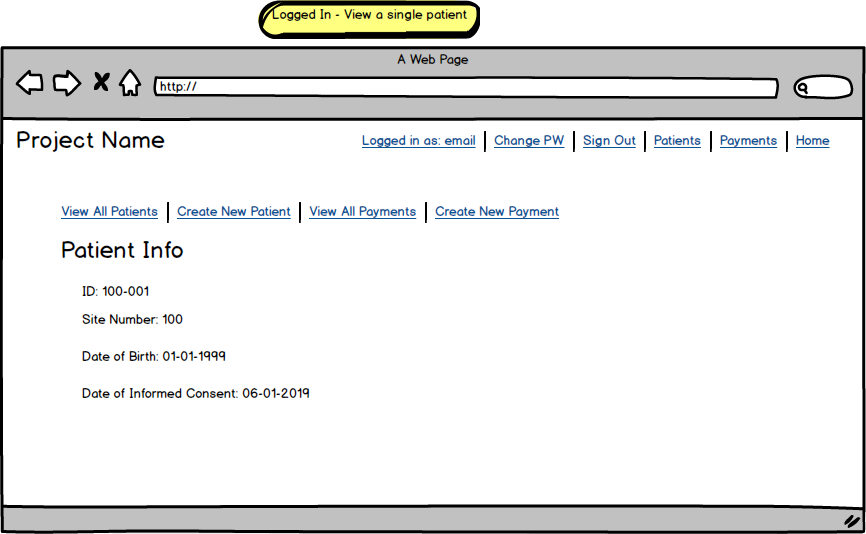
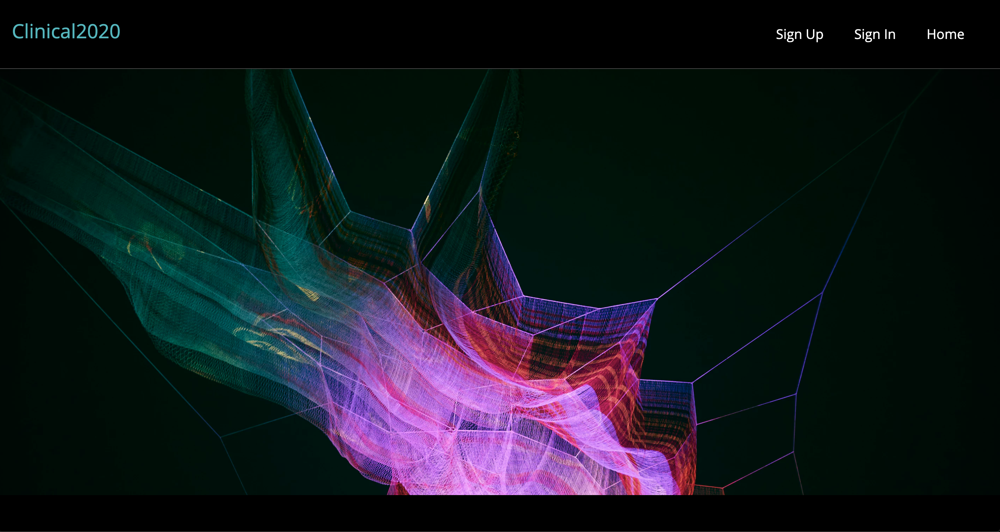

Back-End Repo: https://github.com/shaider0/clinical2020api
Deployed Back End: https://clinical2020.herokuapp.com/

Clinical2020 is a case report form system that allows organizations involved in conducting clinical research to store clinical data collected from patients who participate in their studies.

# Technologies Used

- ReactJS: Front-end framework
- Express: Back-end framework
- NodeJS: JavaScript Runtime
- MongoDB: NoSQL Database
- Mongoose: Object Data Modeling

# How the App works

The current version of the application is an early prototype which gives users the ability to

1. Sign up
2. Sign in
3. Create a new patient
4. Enter information about a patient
5. View information entered about a patient
6. Edit previously entered information about a patient
7. Delete a patient
8. For a given patient, create a physical exam
9. Enter the results of the exam
10. View results of previous exams
11. Edit existing exams
12. Delete existing exams
13. Create a payment
14. Enter information about a payment
15. View previous payments
16. Edit existing payments
17. Delete existing payments

# Future Improvements

In future iterations, additional assessment types beyond physical exam will be added. Unsolved problems that will be addressed in future iterations include:
  - Using date as an input type (e.g., using MomentJS library) for all date data
  - Automatically calculating payments

# Planning, Process, and Problem-solving

1. Understand project requirements
2. Develop wireframes & user stories
3. Define entity relationships
4. Build & test back-end
5. Build and test front-end
6. Remove bugs
7. Improve UX & style
8. Complete documentation

# User Stories

As a user, I want to be able to log in, create, view, edit, and delete information about
patients in my studies. I also want to be able to perform these same actions for specific
assessments completed on my patients, such as physical exams. I also want to be able to generate
payment information (e.g., to be used to create an invoice) based on the work I've done for the study
(in this case, data entry)

# Wireframes

# Screenshot of deployed client 

